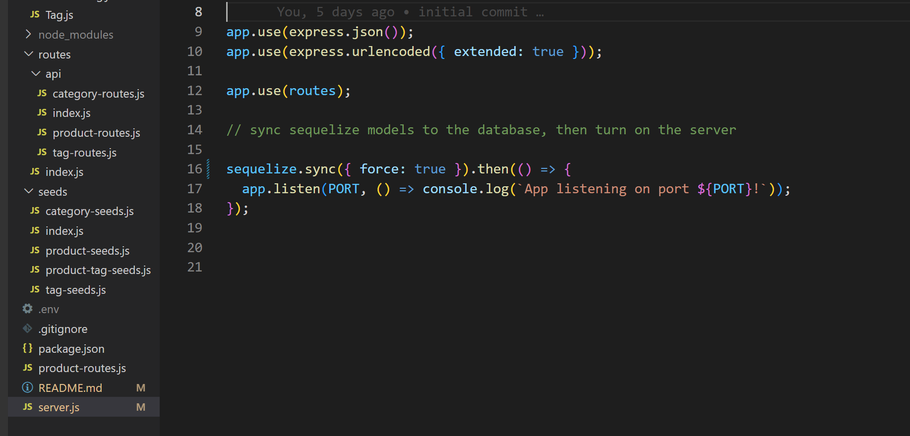

  
# Project Title - e-Commerce
  
  
## Project Description
Back-end for an e-Commerce site.

  
## Table of Contents
  - [Installation](#installation)
  - [Usage](#usage)
  - [License](#license)
  - [Contributing](#contributing)
  - [Tests](#tests)
  - [Questions](#questions)
  
## Installation

You'll need mysql, as well as the following packages.   Please check out [mysql.com](https://www.mysql.com/) for installation instructions for MySQL.  
You'll also need to install these dependencies.  
 "dependencies":
    "dotenv": "^8.2.0",
    "express": "^4.17.1",
    "mysql2": "^2.1.0",
    "seed": "^0.4.4",
    "sequelize": "^5.22.5"
You'll also need to visit the [dotenv](https://www.npmjs.com/package/dotenv) web site to configure the sql logon information for sequelize.  

Connect to https://github.com/roo116/e-commerce and either fork or clone the repo.  
Go the directory of the cloned repo and run `npm i` to install the dependencies.  
To create the database, make sure MySQL is installed, and run this from the root of the e-commerce directory.  
`source db\schema.sql`  
Set the sequelize sync statement to `true` in the server.js file, and then type `npm start` in a terminal to create the tables.  
  
Once tables are created, `ctrl-c` to stop the server and reset the sync statement to false. 
Run `npm run seed` to put sample data into the tables.  
then run `npm start` to restart the application server. 

Video to show the steps to get the database running:  
[Set up database](https://drive.google.com/file/d/1CDJHKKSRV2yO2OLbSeJ4ftZjYlx17_S6/view?usp=sharing)

  
## Usage
API routes have been set up to return product data from the database tables.  These API routes can be used for an application, or feel free to create your own.  
This [video](https://drive.google.com/file/d/1LMBsrFtp5iTCHD4d_gq9v5AwKi4TnBTP/view?usp=sharing) shows examples of the functionality of the routes. 

  
## License
ISC
  
## Contributing
See contact information below to find out how to contribute.
  
## Tests

These criteria were tested and resolved correctly. 

Acceptance criteria  
AS A manager at an internet retail company  
I WANT a back end for my e-commerce website that uses the latest technologies  
SO THAT my company can compete with other e-commerce companies  

PASSED:
GIVEN a functional Express.js API  
WHEN I add my database name, MySQL username, and MySQL password to an environment variable file
THEN I am able to connect to a database using Sequelize  
WHEN I enter schema and seed commands
THEN a development database is created and is seeded with test data  
WHEN I enter the command to invoke the application
THEN my server is started and the Sequelize models are synced to the MySQL database  
WHEN I open API GET routes in Insomnia for categories, products, or tags
THEN the data for each of these routes is displayed in a formatted JSON  
WHEN I test API POST, PUT, and DELETE routes in Insomnia
THEN I am able to successfully create, update, and delete data in my database  
  

## Questions
If you have questions, reach out via email or GitHub  
Gitub:  [GitHub Repository](https//github.com/roo116)  
Email:  hillkarl03@gmail.com  
  